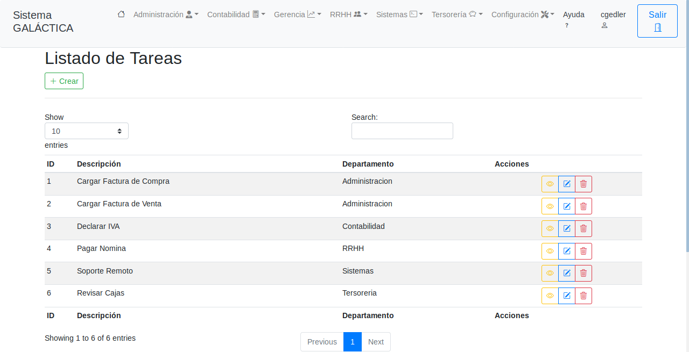
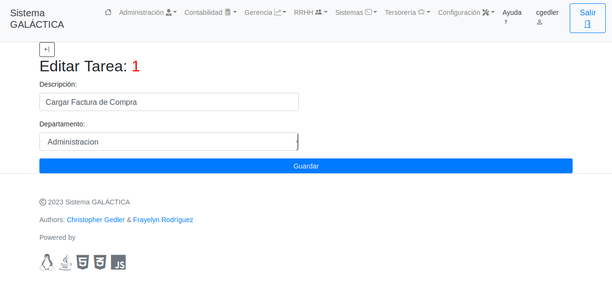
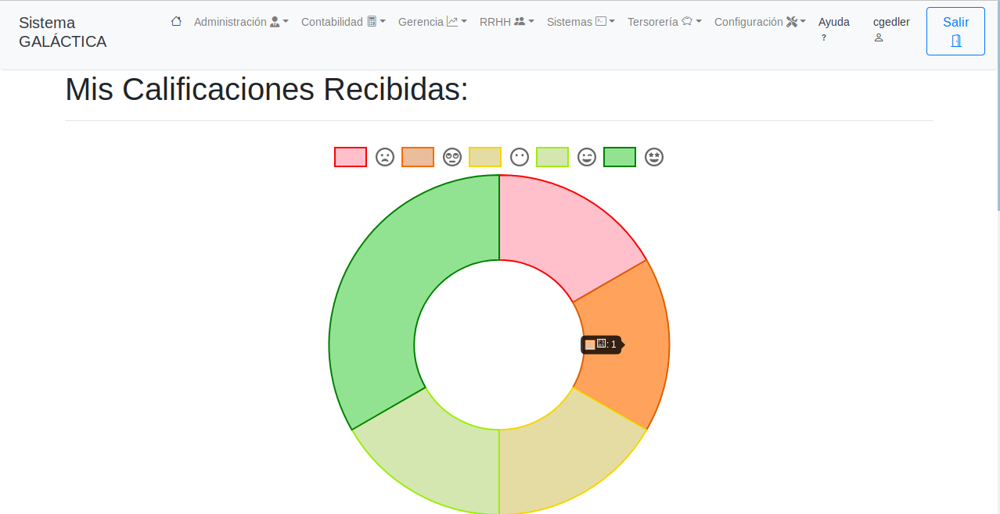

# Galactica

Galactica is a web system to automate and control processes management of requests services inside of the organization. It will allow you to better manage information, obtain standardization of procedures and management and organization of internal documents. Also allow tracking of any change in their status. The system has several modules:

  - A module to register users and assign the corresponding access permissions to the application.
  - A module to record the basic usage information of the system, such as departments, employees, tasks performed in the departments.
  - A module per department to display the number of active and in-process tasks per employee.
  - A module to rate the activities completed by employees.
 
This system was developed with Java-Spring Framework, PorstgreSQL was used for data persistence, this was implemented on a Windows Server 2016 with Tomcat.

# Screenshots

